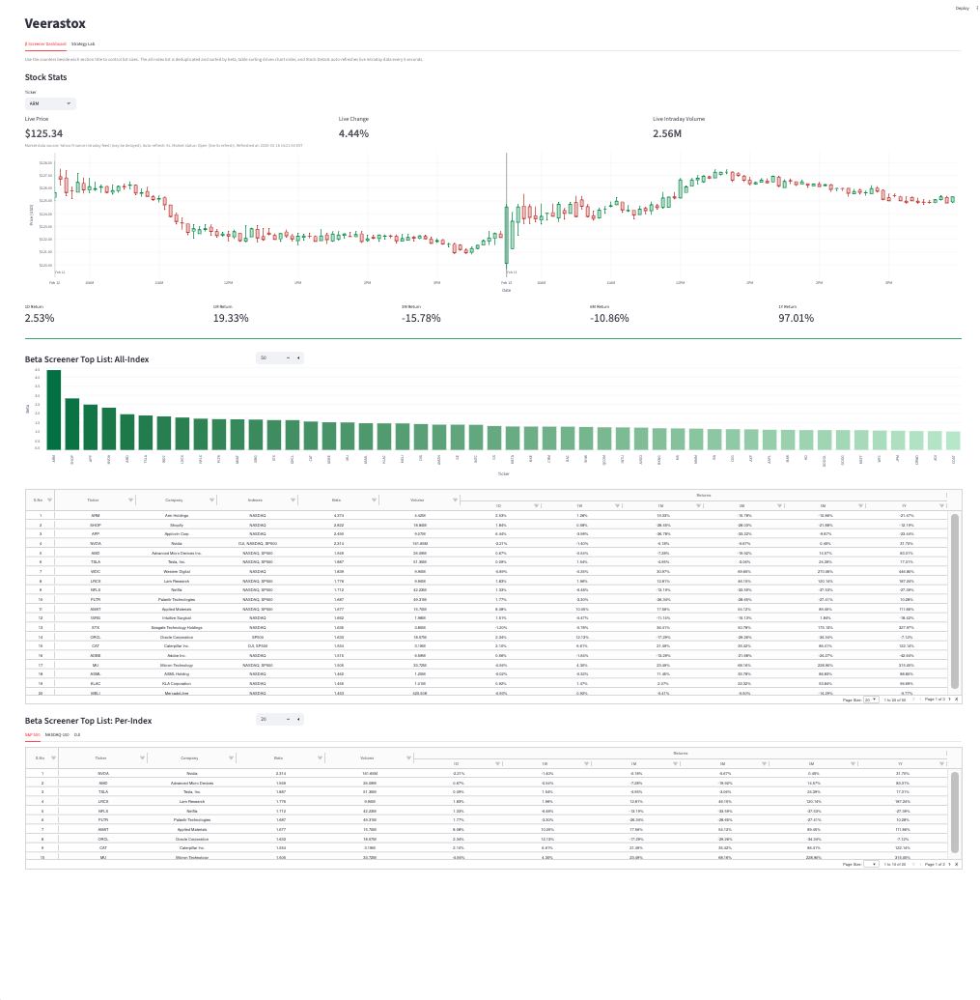
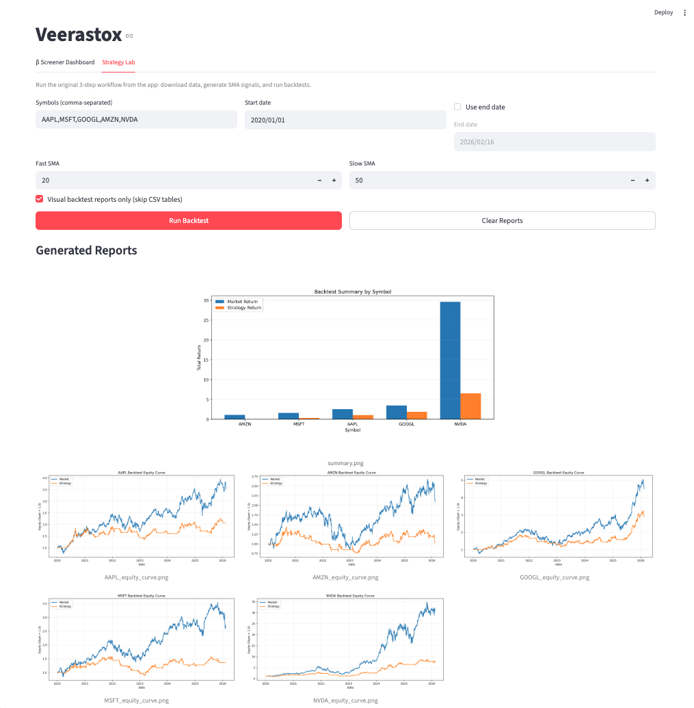

# veerastox

`veerastox` is a **beta screener first** project.

<p>
  
  
</p>

## Primary Purpose

The main purpose of this repository is to screen and rank high-beta stocks across:
- S&P 500 Top 50
- NASDAQ-100 Top 50
- DJI Top 30

and produce:
- per-index top beta lists
- a final deduplicated all-index beta ranking

## Secondary Purpose (Optional Lab Kit)

In addition to screening, this repo includes an **optional strategy lab** for experimentation:
- download price history
- generate SMA crossover signals
- run a simple long-only backtest
- view reports in CLI and Streamlit

Treat the data pipeline as a lab/research module, not as the core objective.

## What Is Included

- CLI commands for beta screening, data pipeline, cleanup, and web app launch
- Streamlit app with two tabs:
  - `β Screener Dashboard` (beta screener + live stock stats)
  - `Strategy Lab` (optional backtest workflow)
- Config via `.env` + `config/watchlist.txt`
- `init_project.sh` for one-command project initialization

## Repository Structure

```text
config/
  watchlist.txt
data/
  raw/
  processed/
reports/
scripts/
  beta_top_indexes.py
  get_data.py
  generate_signals.py
  run_backtest.py
src/invest/
  config.py
  data_provider.py
  signals.py
  backtest.py
  cli/
    get_data.py
    generate_signals.py
    run_backtest.py
    cleanup.py
    beta_top20_sp500.py
    beta_top20_nasdaq.py
    beta_top20_dji.py
    beta_top_50_all.py
    webapp.py
  webapp/
    app.py
init_project.sh
pyproject.toml
requirements.txt
```

## Requirements

- Python `>=3.10`
- `pip`
- Internet access (Yahoo Finance + Slickcharts)

Dependencies:
- `pandas`
- `numpy`
- `yfinance`
- `python-dotenv`
- `matplotlib`
- `lxml`
- `streamlit`
- `streamlit-aggrid`
- `plotly`

## Setup

### Manual setup

```bash
cp .env.example .env
python3 -m pip install -r requirements.txt
python3 -m pip install --no-deps -e .
python3 -m compileall src scripts
```

### One-shot setup

```bash
./init_project.sh
```

`init_project.sh` runs:
1. `python3 -m pip install -r requirements.txt`
2. `python3 -m pip install --no-deps -e .`
3. `python3 -m compileall src scripts`

Optional: run one supported command after setup:

```bash
./init_project.sh veerastox-beta-all
./init_project.sh veerastox-webapp
```

### Docker setup (optional)

Run the web app in Docker Desktop and access it from your host browser.

Prerequisites:
- Docker Desktop installed and running.
- `.env` present at project root (copy from `.env.example` if needed).

Build and start:

```bash
docker compose up --build
```

Detached mode:

```bash
docker compose up -d --build
```

Open in host browser:
- `http://localhost:8501`

Stop:

```bash
docker compose down
```

Notes:
- Container service name: `veerastox-webapp`
- Port mapping: `8501:8501`
- Mounted folders keep local data/report continuity:
  - `./data -> /app/data`
  - `./reports -> /app/reports`
  - `./config -> /app/config`
  - `./.env -> /app/.env` (read-only)

## Configuration

### `.env`

Template: `.env.example`

```env
DEFAULT_SYMBOLS=AAPL,MSFT,GOOGL
START_DATE=2020-01-01
END_DATE=
FAST_SMA=20
SLOW_SMA=50
```

Meaning:
- `DEFAULT_SYMBOLS`: fallback symbols when no watchlist symbols are available.
- `START_DATE`: default data download start date.
- `END_DATE`: optional end date (empty means open end).
- `FAST_SMA`: default fast SMA window.
- `SLOW_SMA`: default slow SMA window.

### Watchlist

File: `config/watchlist.txt`
- one symbol per line
- blank lines ignored
- `#` comments ignored
- symbols are normalized to uppercase

### Symbol precedence

For CLI data pipeline tools:
1. `--symbols`
2. `config/watchlist.txt`
3. `DEFAULT_SYMBOLS`

For Strategy Lab:
1. typed symbol input in UI
2. prefilled values from watchlist or `.env`

For β Screener Dashboard beta tables:
- symbols come from index universes and beta-screen generation, not watchlist.

## CLI Command Catalog

### Core beta screener commands (main purpose)

- `veerastox-beta-sp500 [individual_count]`
- `veerastox-beta-nasdaq [individual_count]`
- `veerastox-beta-dji [individual_count]`
- `veerastox-beta-all [individual_count] [final_count]`

### Optional lab-kit commands

- `veerastox-get-data`
- `veerastox-generate-signals`
- `veerastox-run-backtest`
- `veerastox-cleanup`

### App launcher

- `veerastox-webapp`

---

## Beta Screener: Detailed Functioning

Underlying engine: `scripts/beta_top_indexes.py`

Data sources:
- constituents via Slickcharts HTML tables:
  - `https://www.slickcharts.com/sp500`
  - `https://www.slickcharts.com/nasdaq100`
  - `https://www.slickcharts.com/dowjones`
- beta via `yfinance`: `yf.Ticker(ticker).info.get("beta")`

Universe sizes:
- `sp500`: top 50 constituents
- `nasdaq`: top 50 constituents
- `dji`: top 30 constituents

### CLI wrappers and routing

- `veerastox-beta-sp500` routes to `--index sp500`
- `veerastox-beta-nasdaq` routes to `--index nasdaq`
- `veerastox-beta-dji` routes to `--index dji`
- `veerastox-beta-all` routes to `--index all`

The wrappers execute `scripts/beta_top_indexes.py` using `runpy`.

### Arguments and precedence

Shared engine args:
- positional `individual_count` (optional)
- positional `final_count` (optional)
- `--top-per-index` (default `20`)
- `--final-top` (default `50`)
- `--no-fill`

Precedence rules:
- if positional `individual_count` is passed, it overrides `--top-per-index`
- if positional `final_count` is passed, it overrides `--final-top`

Validation rules:
- both counts must be positive integers
- `final_count` is valid only with `--index all` (single-index mode rejects it)

### How final combined ranking is built

Default (`fill=True`, no `--no-fill`):
- compute beta-ranked lists from full index universes
- concatenate full lists
- dedupe by ticker
- aggregate:
  - `Company`: first seen value
  - `Beta`: maximum beta among duplicates
  - `Indexes`: merged unique index ids
- sort by beta descending
- truncate to `final_top`

Strict mode (`--no-fill`):
- final list is built only from currently displayed per-index top lists
- then dedupe/aggregate/sort/truncate

### Examples

```bash
# per-index screens
veerastox-beta-sp500
veerastox-beta-sp500 25
veerastox-beta-nasdaq 20
veerastox-beta-dji 15

# combined screen
veerastox-beta-all
veerastox-beta-all 20 50
veerastox-beta-all 25 60 --no-fill
```

---

## Optional Lab Kit: Detailed Functioning

### `veerastox-cleanup`

Purpose:
- delete generated artifacts from:
  - `data/raw`
  - `data/processed`
  - `reports`

Flags:
- `--raw`
- `--processed`
- `--reports`
- `--dry-run`

Behavior:
- if no scope flag is provided, all three scopes are cleaned
- target dirs are created if missing
- files and subdirectories are removed recursively

Examples:

```bash
veerastox-cleanup
veerastox-cleanup --dry-run
veerastox-cleanup --reports
```

### `veerastox-get-data`

Purpose:
- download OHLCV history and save raw CSVs.

Args:
- `--start YYYY-MM-DD`
- `--end YYYY-MM-DD`
- `--symbols AAPL,MSFT,...`

Internals:
- calls `yfinance.download(symbol, start, end, auto_adjust=True)`
- flattens MultiIndex columns if returned
- lowercases all column names
- appends `symbol` column

Output:
- `data/raw/<SYMBOL>.csv`

Examples:

```bash
veerastox-get-data
veerastox-get-data --start 2022-01-01
veerastox-get-data --start 2022-01-01 --end 2024-12-31
veerastox-get-data --symbols AAPL,MSFT,NVDA
```

### `veerastox-generate-signals`

Purpose:
- read raw CSVs and generate SMA crossover signals.

Args:
- `--fast INT`
- `--slow INT`
- `--symbols AAPL,MSFT,...`

Validation:
- `fast < slow` required
- input must contain `close`
- non-numeric `close` rows are dropped
- empty post-cleaning input raises error

Generated columns:
- `fast_sma`
- `slow_sma`
- `signal` (1 when `fast_sma > slow_sma`, else 0)
- `position_change` (`signal.diff().fillna(0)`)

Output:
- `data/processed/<SYMBOL>_signals.csv`

Examples:

```bash
veerastox-generate-signals
veerastox-generate-signals --fast 10 --slow 30
veerastox-generate-signals --symbols AAPL,MSFT
```

### `veerastox-run-backtest`

Purpose:
- run a simple long-only strategy backtest.

Args:
- `--symbols AAPL,MSFT,...`
- `--visual-only`

Core formulas:
- `daily_return = close.pct_change()`
- `strategy_return = daily_return * signal.shift(1)`
- `equity_market = (1 + daily_return).cumprod()`
- `equity_strategy = (1 + strategy_return).cumprod()`

Summary metrics:
- `market_return`
- `strategy_return`
- `alpha_vs_market`
- `max_drawdown`

Outputs:
- per symbol:
  - `reports/<SYMBOL>_equity_curve.png`
  - `reports/<SYMBOL>_equity_curve.csv` (unless `--visual-only`)
- combined:
  - `reports/summary.png`
  - `reports/summary.csv` (unless `--visual-only`)

Examples:

```bash
veerastox-run-backtest
veerastox-run-backtest --symbols AAPL,MSFT
veerastox-run-backtest --visual-only
```

---

## Streamlit App: Full Feature Reference

Launch:

```bash
veerastox-webapp
```

Runs:

```bash
python -m streamlit run src/invest/webapp/app.py
```

### Global app behavior

- page title: `Veerastox`
- layout: wide
- tabs:
  - `β Screener Dashboard`
  - `Strategy Lab`

Data caching (`st.cache_data`) is used across network-heavy functions.

## β Screener Dashboard (Feature-by-Feature)

### Section: Stock Stats

Controls:
- `Ticker` selectbox
  - options seeded from final all-index beta list
  - `accept_new_options=True` allows manual symbol entry
  - width adapts to current ticker text length

Live cards:
- `Live Price`
- `Live Change`
- `Live Intraday Volume`

Market-hours mode switch:
- market open (`Mon-Fri`, `09:00-16:00` ET):
  - live quote source: `fetch_realtime_quote`
  - auto-refresh every 5s
- market closed:
  - snapshot source: `fetch_offhours_snapshot`
  - auto-refresh disabled

Color logic:
- market open:
  - compares current value vs previous refresh (per ticker)
  - green for up, red for down
  - unchanged keeps previous trend color
- market closed:
  - color derived from latest session vs previous session
  - price/change color from session close change
  - volume color from session-volume change

Status line includes:
- data source note
- refresh mode (`5s` or off)
- market status (`Open`/`Closed` mode text)
- refreshed/as-of timestamp

#### Stock chart behavior

Data composition:
- base: full-history daily close (`period=max`, `interval=1d`)
- intraday overlay: current day 1-minute close (`interval=1m`)
- intraday filtering: only `09:00-16:00` ET
- daily timestamps aligned to `16:00` so daily points do not appear at midnight
- if market open, latest price can update last plotted point

Interactivity:
- Plotly line chart
- mouse-wheel zoom enabled
- drag pan enabled
- `uirevision` used to preserve zoom/pan state during data updates

Axis behavior:
- x-axis switches label format by zoom scale:
  - tighter zoom: hourly labels
  - wider zoom: day labels
- midnight hour labels are suppressed
- for zoomed interday windows (<=3 days), day-boundary overlays can show date markers

Returns shown under chart:
- `1D Return`
- `1M Return`
- `3M Return`
- `6M Return`
- `1Y Return`

### Section: Beta Screener Top List: All-Index

Controls:
- `Final list count` number input
  - drives final deduplicated list size
  - default session value starts at `50`

Table:
- columns:
  - `S.No`, `Ticker`, `Company`, `Indexes`, `Beta`, `Volume`, `1D`, `1W`, `1M`, `3M`, `6M`, `1Y`
- features:
  - sorting
  - filtering
  - resizing
  - pagination
  - centered headers
  - multi-level `Returns` header
  - `Beta` fixed to 3 decimals
  - `Volume` compact format (`K/M/B`)
  - return columns as percentages

Linked chart:
- bar chart of `Ticker` vs `Beta`
- follows current table order (including sorted order)
- green gradient from darker to lighter across order

### Section: Beta Screener Top List: Per-Index

Controls:
- `Individual list count` number input
  - controls each index top list size
  - default session value starts at `20`

Tabs:
- `S&P 500`
- `NASDAQ-100`
- `DJI`

Per-tab table columns:
- `S.No`, `Ticker`, `Company`, `Beta`, `Volume`, `1D`, `1W`, `1M`, `3M`, `6M`, `1Y`

Table behavior is same class as all-index grid:
- sortable
- filterable
- paginated
- compact numeric and return formatting

## Strategy Lab (Feature-by-Feature)

Purpose:
- optional execution of the 3-step data pipeline inside the app.

Inputs:
- `Symbols (comma-separated)`
- `Start date`
- `Use end date` checkbox
- `End date` (enabled only when checkbox is true)
- `Fast SMA`
- `Slow SMA`
- `Visual backtest reports only (skip CSV tables)` checkbox

Actions:
- `Run Backtest`
- `Clear Reports`

Validation:
- `Fast SMA` must be lower than `Slow SMA`

`Run Backtest` execution sequence:
1. download raw history
2. generate SMA signals
3. auto-clean old report files (`reports/*.csv`, `reports/*.png`)
4. run backtests and save reports

`Clear Reports` behavior:
- removes current report PNG/CSV files from `reports/`
- clears persisted summary table in session state

Rendered output blocks:
- `Backtest Summary`
  - displayed via AgGrid
  - columns normalized to readable names:
    - `Symbol`, `Market Return`, `Strategy Return`, `Alpha Vs Market`, `Max Drawdown`
- `Generated Reports`
  - `summary.png` centered with dynamic width policy by row count
  - other PNG reports arranged 3 per row
- `CSV Tables`
  - shown only when visual-only mode is OFF
- `Pipeline Logs`
  - shown last

## Output Artifacts

Raw data:
- `data/raw/<SYMBOL>.csv`

Processed signals:
- `data/processed/<SYMBOL>_signals.csv`

Backtest reports:
- `reports/<SYMBOL>_equity_curve.png`
- `reports/<SYMBOL>_equity_curve.csv` (if CSV not skipped)
- `reports/summary.png`
- `reports/summary.csv` (if CSV not skipped)

## Caching And Refresh Detail

Cached functions and TTL:
- `build_final_list`: 3600s
- `fetch_market_data`: 1800s
- `fetch_latest_volume`: 1800s
- `fetch_realtime_quote`: 5s
- `fetch_intraday_close`: 5s
- `fetch_offhours_snapshot`: 900s
- `fetch_inception_close`: 900s
- `fetch_single_ticker_close`: 30s

Implications:
- repeated UI interactions do not always trigger new network calls
- live mode still targets near-real-time behavior during market hours
- off-hours mode uses stable snapshot semantics

## Quick Command Reference

```bash
# Main purpose: beta screening
veerastox-beta-sp500 [individual_count]
veerastox-beta-nasdaq [individual_count]
veerastox-beta-dji [individual_count]
veerastox-beta-all [individual_count] [final_count]

# Optional lab kit
veerastox-cleanup [--raw] [--processed] [--reports] [--dry-run]
veerastox-get-data [--start YYYY-MM-DD] [--end YYYY-MM-DD] [--symbols CSV]
veerastox-generate-signals [--fast INT] [--slow INT] [--symbols CSV]
veerastox-run-backtest [--symbols CSV] [--visual-only]

# Web app
veerastox-webapp
```

## Troubleshooting

### CLI command not found or `ModuleNotFoundError`

```bash
python3 -m pip install --no-deps -e .
python3 -m compileall src scripts
```

### Missing dependencies (example: `plotly`)

```bash
python3 -m pip install -r requirements.txt
```

### Streamlit telemetry prompt on first run

This is Streamlit default first-run behavior.

### Empty/partial data

Possible causes:
- ticker unavailable/delisted
- upstream response gaps/rate limits
- period/interval mismatch for requested symbol

## Prompts Folder

Prompt templates are provided in `prompts/`:
- `prompts/recreateme.md` (repo-specific)
- `prompts/recreate-project.md` (full template)
- `prompts/recreate-project-lite.md` (lite template)
- `prompts/README.md` (usage)

## Scope And Disclaimer

- This project is for research/education.
- It is not an order execution system.
- No financial advice is provided.
- Strategy and risk assumptions are intentionally simple and should be extended before production use.
